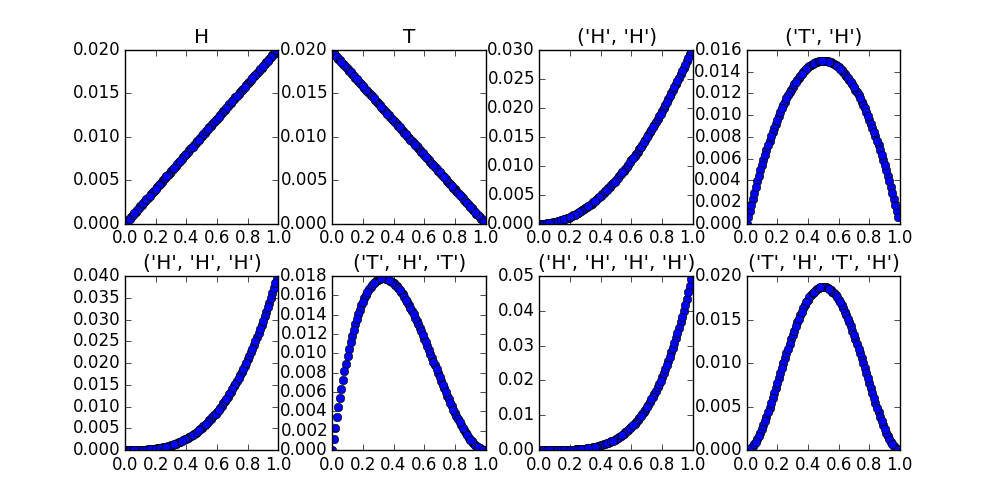

Title: Out of the Frying Pan
Date: 2015-7-19 22:00
Modified: 2015-7-20 08:57
Category: Blog
Tags: galvanize
Slug: out-of-the-frying-pan
Authors: Cary Goltermann
Summary: Basically everything that we've done in class up until this point has been prep work for the real shit, data science...-ing.

Now that we are sufficiently well versed in foundational scipy stacking, and in some basic statistics, it's time to start filling the "brain-tank" with "premimum 91 octane knowledge." (-Barney Stinson) No longer is class going to be mainly about python and mathematical theory, we're getting on that actual data science horse and riding it all the way to knowing-stuff-ville. (I appologize for my slightly ridiculous language, I just finished binge-watching Silcon Valley and apparently one of the charachers, Erlich, and his absurd personality has rubbed off on me.)

### Last Couple of Days
On friday we learned about multi-armed bandit techniques and wrote -> implemented various strategies, UCB1, softmax, epislon greedy, and a bayesian approach. It was pretty cool actually feeling like I was doing something that wasn't just tangentially related to data science, but squarely in that sphere. 

The day before we worked on creating an bayesian inference engine that updates beliefs about the distribution of a random variable by passing in data. For example, we passed the data of coin flips to the engine and had it plot the probability distribution for a coin where a head has value 1 and a tail 0.

<h3>Coin Flips</h3>

You can see how after different flip combinations the belief distribution about the nature of the coin's tendencies as a random side generator are altered. I think it's pretty fucking cool. But I'm super nerdy in that way, in case the enrolled in a data science course status didn't give that away already.
### Coming Up
This week we're going to start to work on regressions. At least linear to begin with, I don't know if we're going to cover more advanced regression at any point, though I'm fairly sure we'll at least touch on logistic ones. Definitely a simple concept. But there's obviously a lot of power in it, from using a linear regression to estimate a parameter in a larger model to looking at data with a multi linear regression. I, by no means, have a wide array of knowledge regarding all of the applications linear regressions are used for; but, hopefully by the end of tomorrow I'll have a better idea about how I'll be using them as a data scientist.

### Notes
So I managed to get in something of a workout today, I played volleyball for almost 2 hours. It was definitely fun and I was certainly tired once I left, so I'm counting it as a workout as therefore my commitment fulfilled. My next commitment is definitely going to be to working on what I'm going to say when I'm officiating one of my best friend's weddings at the end of this week. I'm off to bed so that I can get to Galvanize early and row again tomorrow morning. Last week I did 4500 m in 20 minutes. I want to get 4750 tomorrow. Hopefully that's not too much to ask. So I'm off to recharge my brain. Go-go-gadget REM sleep!

Update: (Monday morning) I did not manage to pull myself out of bed this morning early enough to get a rowing session in. Hopefully that happens tomorrow...
